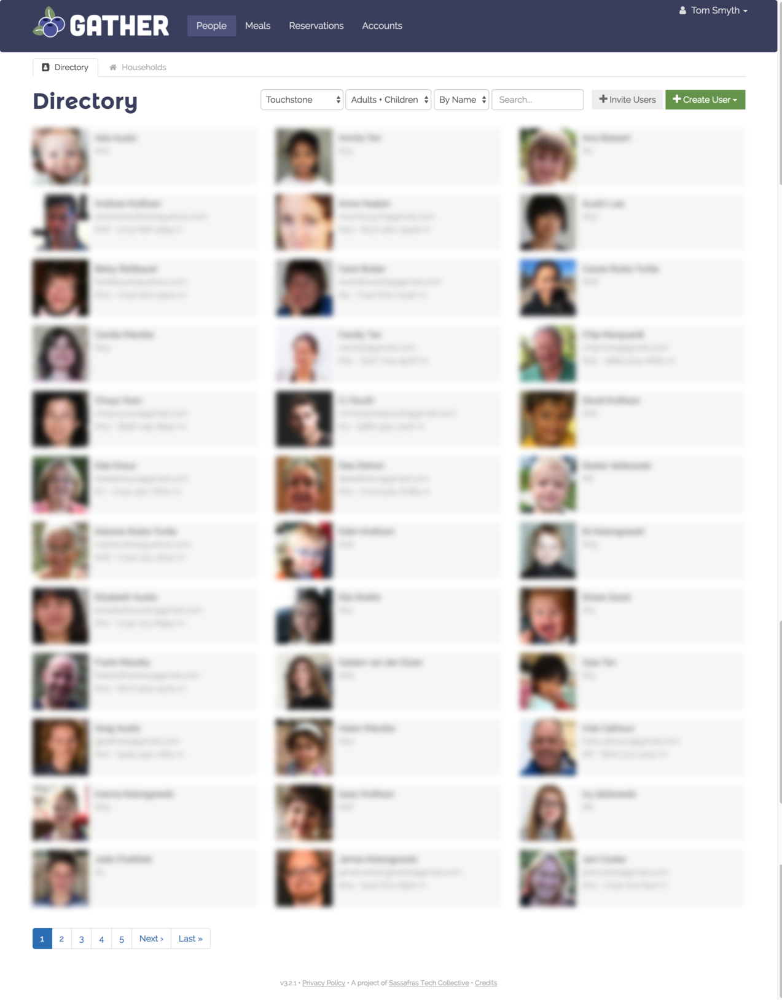

## Gather is Software for Community.

Gather's mission is to **make community easier** so members can focus on having fun and building relationships.

Created in 2015, Gather has been host to over 300 users, $50,000 worth of shared meals, 3,000 resource reservations, and much more.

**[Request an account](/accountrequest) to try it out for free!**
